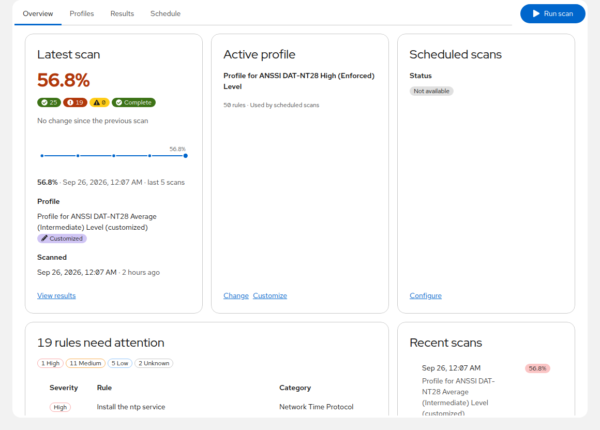
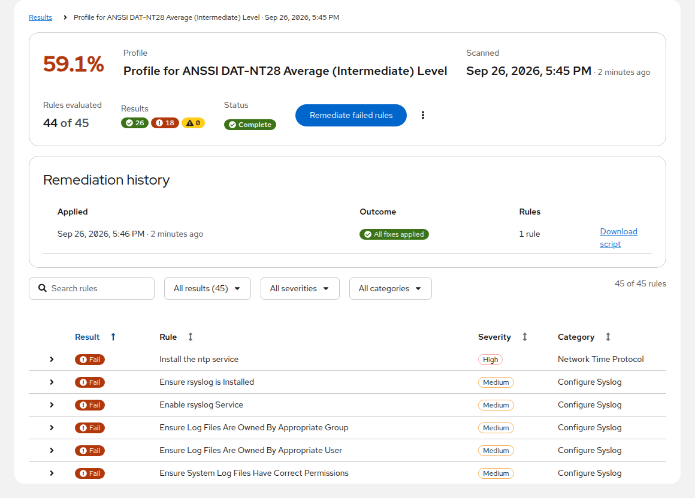
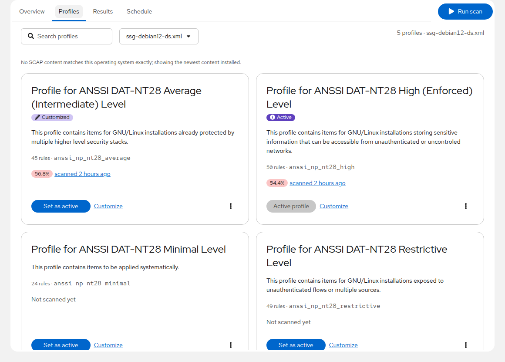
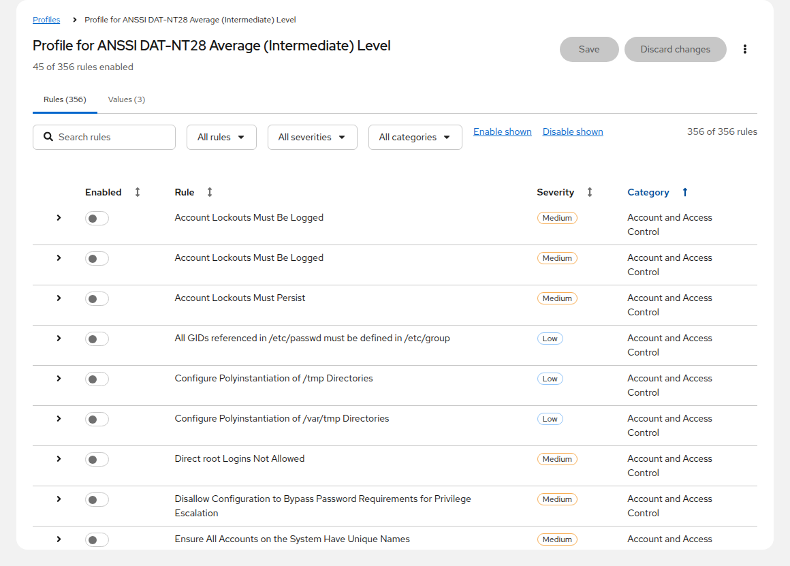
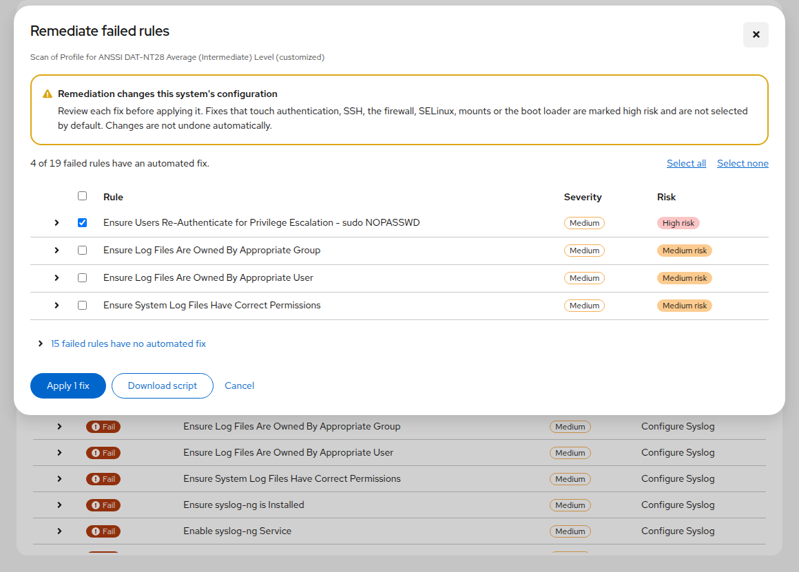
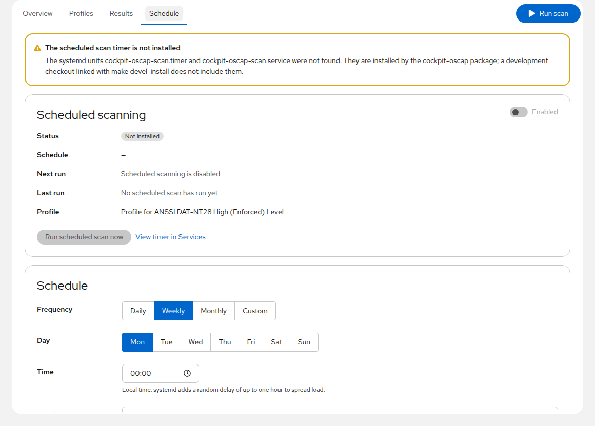

# cockpit-oscap

OpenSCAP compliance scanning for the [Cockpit](https://cockpit-project.org/)
web console.

cockpit-oscap turns the OpenSCAP scanner and the
[SCAP Security Guide](https://complianceascode.readthedocs.io/) into a
first-class Cockpit page: evaluate the system against profiles such as CIS,
DISA STIG, PCI DSS or ANSSI, drill into every rule, customize profiles, apply
remediation with guard rails, and keep the system continuously assessed with
scheduled scans.

## Screenshots

| Overview | Scan results |
|---|---|
|  |  |

| Profiles | Profile customization |
|---|---|
|  |  |

| Guided remediation | Scheduled scans |
|---|---|
|  |  |

## Features

- **Overview** – the latest compliance score, the change since the previous
  scan and a score trend across the last scans of the profile, the rules that
  need attention (each linking straight to its details), the active profile
  and the state of scheduled scanning at a glance. Cockpit's navigation flags
  the page when the last scan failed or the score is poor.
- **Profiles** – every profile in the SCAP content installed on the system,
  with the OS matched automatically (Fedora, RHEL and derivatives, Debian,
  Ubuntu, openSUSE/SLE, Amazon Linux). Pick the active profile or choose
  between several installed datastreams.
- **Profile customization** – enable or disable rules and adjust values
  (password lengths, timeouts, crypto policies, …) in an editor that groups
  rules by category, shows their description, rationale and references, lets
  you justify every rule you change (kept as an XCCDF remark, so auditors and
  SCAP Workbench see it), review the unsaved changes before saving, and saves
  a standard XCCDF tailoring file. Tailoring files can be imported from and
  exported to SCAP Workbench.
- **Scanning** – run a scan from any page and follow live progress with a
  remaining-time estimate; scans started by the scheduler show the same
  progress banner. Results are stored as ARF plus a JSON summary and pruned
  to a configurable number.
- **Results** – sortable history filterable by profile, per-rule results with on-demand details,
  scanner messages and the rule's history across the profile's recent scans,
  filters by result, severity and category, and a comparison with the previous
  scan of the same profile (new failures, rules now passing) or with any
  earlier one you pick.
  Every scan offers its HTML report, ARF results, a CSV of its rule results,
  and the remediation for its failed rules as a Bash script or an Ansible
  playbook. A failed rule that does not apply can be excluded from the profile
  right there, with a justification; later scans list the excluded rules with
  their justifications next to the score. Results can be deleted one at a time
  or in bulk, and a link can point at one rule of one scan.
- **Guided remediation** – review the bash fix generated for each failed rule,
  with a risk classification (authentication, SSH, firewall, SELinux, boot
  loader and mount changes are flagged high risk and unchecked by default),
  apply the selected fixes one rule at a time, then re-scan with the same
  profile and customizations to verify. Every run is recorded with its
  outcome per rule and shown as the scan's remediation history, with the
  applied script kept for auditing; a Bash script or Ansible playbook can
  also be downloaded to run elsewhere.
- **Scheduled scans** – a systemd timer with daily, weekly, monthly or custom
  `OnCalendar` schedules (validated with `systemd-analyze`), the profile to use
  and result retention, all editable from the page.
- Works with Cockpit's limited-access mode: everything is readable without
  administrative privileges, and privileged actions are disabled with an
  explanation.

## Requirements

- Cockpit ≥ 300
- `oscap` (package `openscap-scanner`, `openscap-utils` on SUSE)
- SCAP Security Guide content in `/usr/share/xml/scap/ssg/content`
  (`scap-security-guide`, or `ssg-base` + `ssg-debian` on Debian/Ubuntu)
- Python ≥ 3.9 (the bridge runs with the system interpreter)

The page only appears in Cockpit's menu when `/usr/bin/oscap` exists. When
the scanner or the content is missing, the page explains what to install.

## Installation

Packages are built from the source tarball: `make rpm` builds an RPM from the
spec in `packaging/` (needs `rpm-build`), `make deb` a Debian package from
`packaging/debian/` (needs `build-essential` and `debhelper`). To install from
a checkout:

```sh
git clone https://github.com/swiftraccoon/cockpit-oscap.git
cd cockpit-oscap
make
sudo make install PREFIX=/usr
sudo systemctl daemon-reload
```

`make install` copies the built page to `$(PREFIX)/share/cockpit/oscap`, the
bridge script next to it and the `cockpit-oscap-scan.service` and `.timer`
units to `$(PREFIX)/lib/systemd/system` (override with `SYSTEMD_UNIT_DIR`).

## Development

Build dependencies on Fedora: `sudo dnf install gettext nodejs npm make python3-pytest`.

```sh
make                 # fetch cockpit's shared libraries, install npm modules, build dist/
make devel-install   # link dist/ into ~/.local/share/cockpit/oscap
make watch           # rebuild on change
make devel-uninstall
```

After `make devel-install`, log into Cockpit as the same user and open
*Compliance*. Scheduled scans need the systemd units, which a development
link does not install; the Schedule page says so.

### Checks

```sh
npm run typecheck    # tsc, strict
npm run eslint
npm run stylelint
ruff check src/oscap-bridge.py test-bridge/
mypy src/oscap-bridge.py
python3 -m pytest    # bridge unit tests; an end-to-end scan runs when oscap and SSG content are installed
npm run test:unit    # frontend helper unit tests (node's test runner, no browser needed)
make lint            # all of the above
make codecheck       # cockpit's static checks
make check           # browser integration tests in a cockpit test VM
```

The same checks run in GitHub Actions on every pull request.

## Architecture

```
src/
  oscap-bridge.py   Python bridge: one script, dispatched by argv[1], JSON on stdout
  api.ts            typed wrappers around cockpit.spawn() for every bridge command
  types.ts          TypeScript mirrors of the bridge's TypedDicts
  tailoring.ts      the profile editor's state and its mapping to XCCDF modifications (unit-tested)
  app.tsx           shell: backend detection, tabs, scan banner, cockpit.location routing
  pages/            Overview, Profiles, TailoringEditor, Results, ResultDetail, Schedule
  components/       ScanDialog, RemediationDialog, RuleDetails, labels, states, ConfirmDialog
systemd/            cockpit-oscap-scan.service + .timer
test-bridge/        pytest suite for the bridge (synthetic datastream and ARF fixtures)
test/               cockpit browser integration tests
```

The frontend spawns the bridge with `python3 -c` and `superuser: "try"`, so
Cockpit escalates through polkit when the session has administrative access.
Long-running commands (`scan`, `remediate`) stream newline-delimited JSON
progress; the bridge also keeps `/var/lib/cockpit-oscap/scan-state.json`
current so every page can show a running scan, interactive or scheduled.

Data lives in `/var/lib/cockpit-oscap`: `config.json` (active profile,
datastream override, retention, tailoring files), `results/` (ARF + JSON per
scan), `tailoring/` and `remediation/` (applied scripts).

## Releasing

Releases are cut from annotated tags named after the version (no `v` prefix):

```bash
git tag -a 1.0 -m "Release notes go here"
git push origin 1.0
```

The `release` workflow then builds `make dist` and publishes the tarball with
the whole tag message as the release note. `git describe` also feeds the version
into the tarball name and the RPM spec.

## License

LGPL-2.1-or-later
